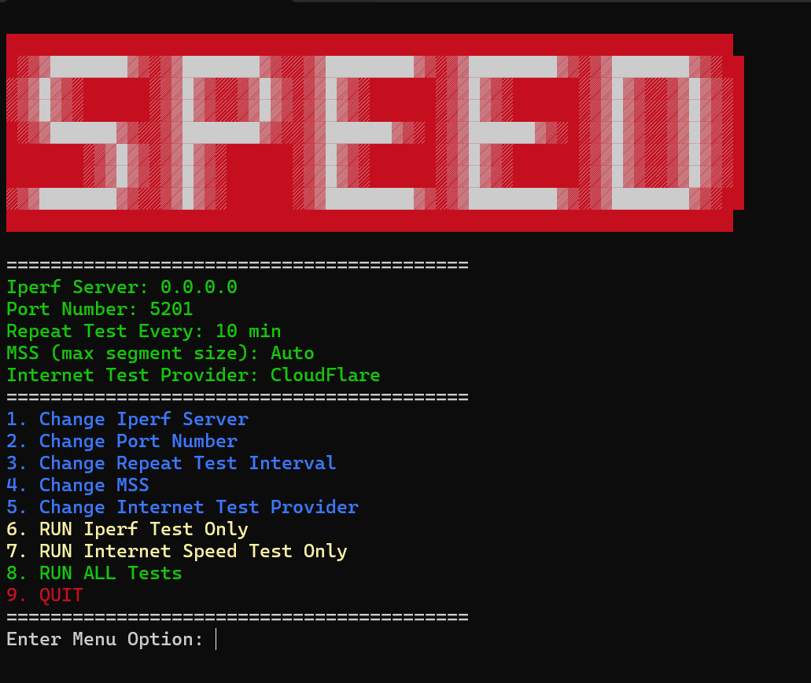

# Speed Tests

A self running app that runs network bandwidth speed test.

It uses [speedtest.net](https://www.speedtest.net/) or [Cloud Flare](https://speed.cloudflare.com/) for the Internet test and [Iperf 3.0](https://iperf.fr/iperf-download.php) for the direct server test.

## Features
- Allows you to run Iperf tests on multiple clients simultaneously to just one Iperf3 server.
- Runs consistenly at whatever interval times you desire (0 min is the default meaning run once only).
- Saves the result to a log file in the same location as the executable for documentation.
- Runs Internet speed test on each pass to document client host bandwidth when performing the iper3 test.
- Allows you to switch between speedtest.net or cloud flare.
- Options you can change: 
    - Port number of the server
    - Frequency time interval
    - MSS segment size for advanced LAN testing

## How to Run
- Setup iperf on a remote server. Default port is 5201. use *-p portnumber* to change.
```
sudo apt install iperf3
iperf3 -s -p 5201
```

- Run latest .exe release
- Choose **Option 1**: to enter Iperf IP address
- Choose **Option 3**: to set a repeat test interval time in minutes to continously run tests until closed
- Choose **Option 5**: to toggle from speedtest.net and cloud flare
- Choose **Option 6**: to Run Iperf3 test only with default settings
- Choose **Option 8**: to Run both Inernet Speed test and Iperf test


